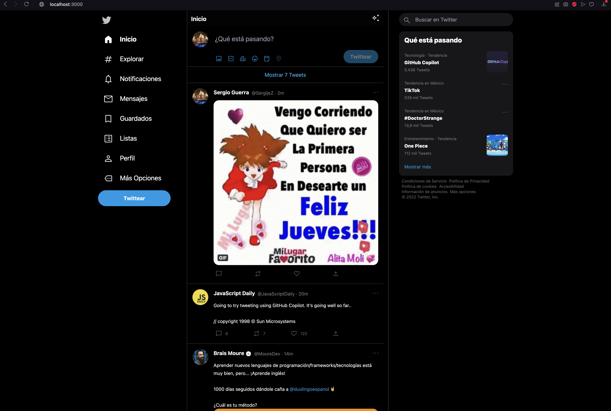

# Twitchter

Twitter mirroring page for the [Twitter Mirroring Challenge](./CHALLENGE.md).

## Features (In Progress)

Twitter feed that displays Tweets of the following types:

* Text tweet.
* Tweet with an image.
* Tweet with up to 4 images.
* Tweet with a GIF.

Each Tweet contains the following functionalities:

* Display the number of likes, retweets or comments.
* Represent hashtag or mentions (without filtering interaction).
* Represent links (with interaction and opening in a browser).
* User photo, name, date, tweet body and action buttons (without the profile edit feature)

Additional features:
* Tweets with video or poll.
* Tweets detail page, showing comments.
* Image detail and zoom.

## Technologies

[](https://svelte.dev/)
[](https://vitejs.dev/)
[](https://tailwindcss.com/)

For details on the decisions made, please review: [Challenge Comments](./COMMENTS.md)

## Recommended IDE Setup

[](https://code.visualstudio.com/)
[](https://marketplace.visualstudio.com/items?itemName=svelte.svelte-vscode)


## Installation

```
git clone git@github.com:Rviewer-Challenges/DyFpegsmIZcelJpMcmVn.git twitchter
cd twitchter
npm install
```

## How to Run?

```
npm run dev
```

## Screenshots

### Main Page (Large)


<br/>


### Main Page (Small)


<br/>


### Main Page (Mobile)


<br/>
<img src="./media/xsOriginalMainPage.png" width=400px  title="Main Page - Original (Mobile)"